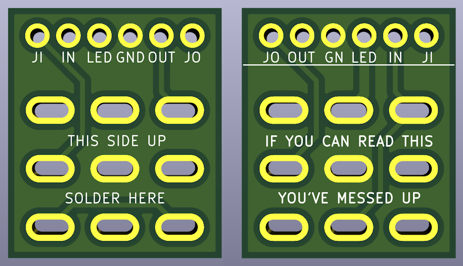
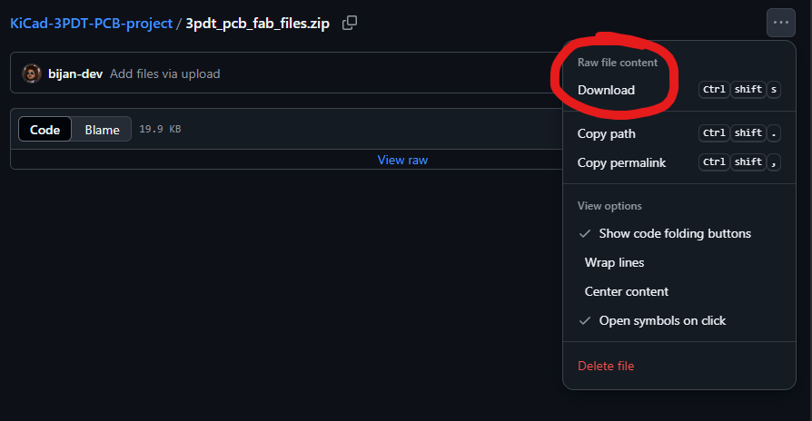
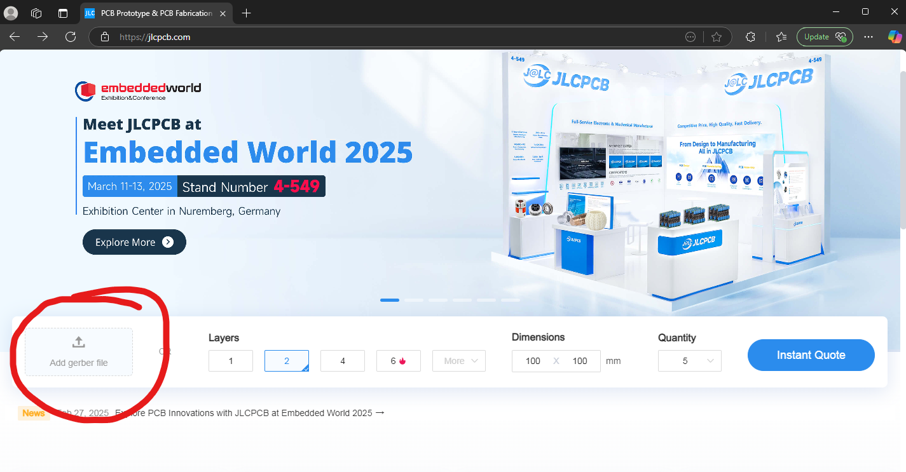
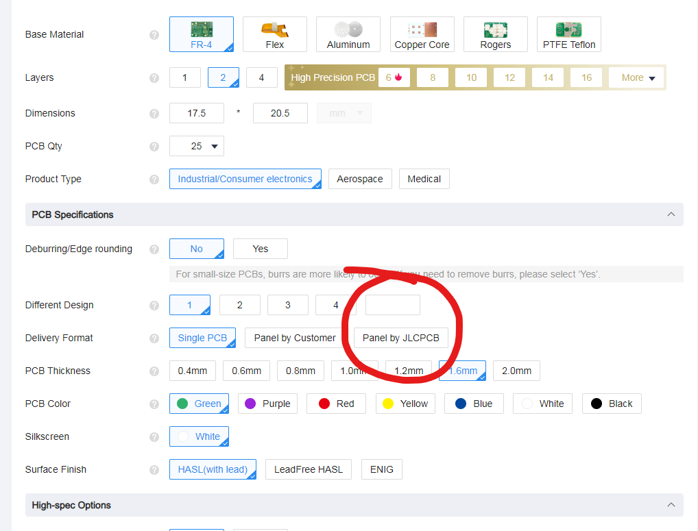
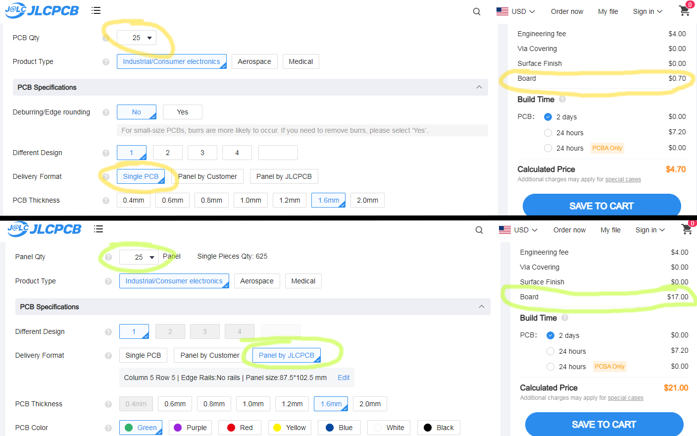
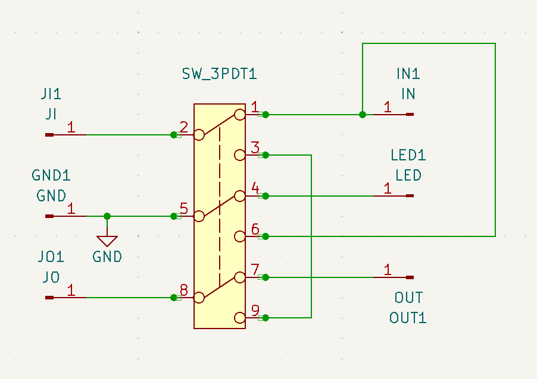
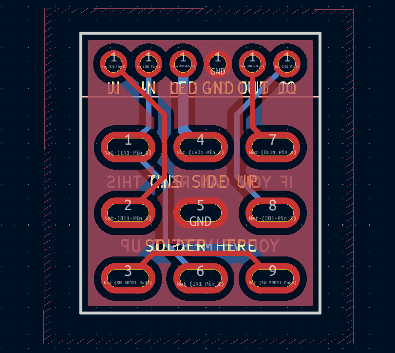

## Note: I haven't ordered one of these yet, so this is unverified at the moment. Let me know if you order one and it works, I'll update this page.

# KiCad-3PDT-PCB-project
A 3PDT PCB for guitar pedals

Hello, this is a KiCad project for a 3PDT PCB board.
This will allow a guitar pedal with a 3PDT [like this](https://stompboxparts.com/footswitches/3pdt-footswitch-solder-lug-vimex/) to be wired in true bypass.

* JI = Input Jack
* IN = PCB Input
* LED = LED connection (assumes an offboard current limiting resistor eg. 4.7k Ohm. Please add one if your effect PCB doesn't have one)
* GND = Ground connection
* OUT = PCB Output
* JO = Output Jack

The wire pads have a pitch of 2.54mm (0.1") to match that of common ribbon cables.

Board width is 17.5mm, height is 20.5mm.

Huge thank you to [Mad Bean](https://www.madbeanpedals.com/) for the pad and 3PDT footprints, their footprint library is the GOAT.

# If you would like to order one

The gerber files are included in the repo.

Click into the `3pdt_pcb_fab_files.zip` file in this repo, then download that zip file.

Then you can use a board fabricator like JLCPCB and upload that zip onto their site.

If you need the gerber files compressed in a different format than .zip, I've included them in the folder `3pdt_pcb_fab_files`.

Here's where to put the file on JLCPCBs website:

Once you drag the .zip onto there, it'll load this page with the PCB, and lots of options for it.
You can click "PCB Qty" to change the number of boards to get. I usually leave everything else default,
except for Surface Finish - LeadFree HASL (personal preference).

Other PCB fab sites should work very similarly.

**NOTE:** JLCPCB has a `panel` option, where they'll lay multiples of these out in a single board. Here's an example of 25 qty ordered in a 5x5 panel.

The board price will go up quite a bit for this though. For 25 boards, single boards on top vs paneled 5x5 below

# Here's screenshots of the schematic and PCB layout:

